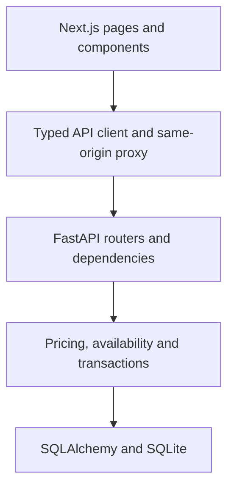
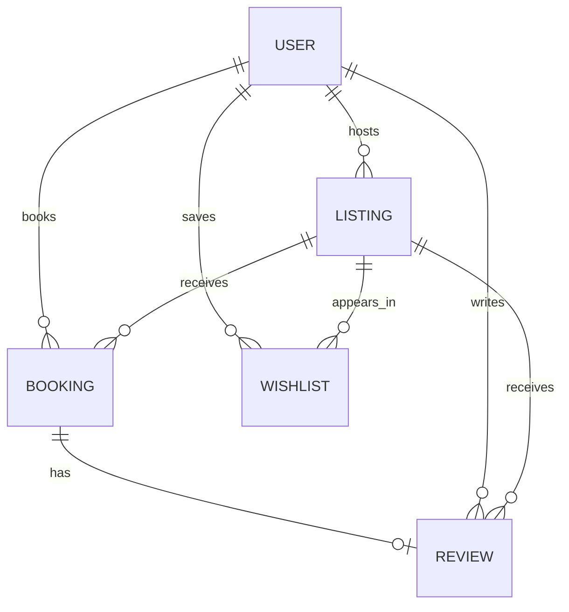

# Airbnb Clone

A five-step full-stack assignment implementation: Next.js App Router, TypeScript,
Tailwind CSS, FastAPI, SQLAlchemy, and SQLite. The source includes Explore, listing
details, mock checkout, reservation receipts, My Trips, and a host dashboard.

This is an independent assignment demo. People, properties, street addresses and
payments are fictional. Images are illustrative. The interface follows the classic
Airbnb browse-and-book layout; pixel-perfect equivalence has not been certified.

## 1. Quick start

Requirements: Python 3.11+ and Node.js 22.6+ (Node 24 recommended). The app itself
supports Node 20.9+, but the included TypeScript calendar tests need Node 22.6+.

### Backend — terminal 1

From the extracted project root:

```bash
cd backend
python -m venv .venv
source .venv/bin/activate
# Windows PowerShell: .venv\Scripts\Activate.ps1
pip install -r requirements-dev.txt
python seed.py
uvicorn app.main:app --reload --host 127.0.0.1 --port 8000
```

### Frontend — terminal 2

```bash
cd frontend
npm ci
cp .env.example .env.local
# Windows PowerShell: Copy-Item .env.example .env.local
npm run dev
```

Open **http://localhost:3000**. API documentation is at
**http://localhost:8000/docs**; health check is **http://localhost:8000/health**.

The Next.js server forwards `/api/*` to FastAPI. The frontend and backend must both
be running. The browser does not need a separate backend URL.

### Environment variables

| Variable | Location | Default / behavior |
| --- | --- | --- |
| `DATABASE_URL` | Backend process | Absolute `backend/airbnb.db` SQLite file, independent of working directory |
| `CORS_ORIGINS` | Backend process | `http://localhost:3000`; comma-separated origins for direct browser API use |
| `API_ORIGIN` | `frontend/.env.local` or frontend environment | `http://127.0.0.1:8000`; must be set before the production build |

`API_ORIGIN` is server-only. Next.js resolves the rewrite destination at build time;
rebuild after changing it. The API does not auto-load a backend `.env` file: export
backend variables in the shell or supply them through the process manager.

Example custom database location:

```bash
DATABASE_URL=sqlite:////absolute/path/demo.db python seed.py
DATABASE_URL=sqlite:////absolute/path/demo.db uvicorn app.main:app --port 8000
```

### Seed data and demo accounts

`python seed.py` creates tables and inserts 4 users, 12 listings, 24 bookings,
12 reviews and 3 wishlist entries. Every listing has five Unsplash photo URLs,
location, amenities, rules, capacity and fees. Each has a past reviewed stay and a
future reservation. Relative seed dates make the demo usable when first installed.

| Fresh DB user ID | Name | Role |
| --- | --- | --- |
| 1 | Sofia Bennett | Host |
| 2 | Arjun Mehta | Host |
| 3 | Emma Wilson | Guest |
| 4 | Noah Kim | Guest |

Use the profile menu to switch accounts. Hosting also offers host-account selection.
`GET /api/demo/users` is the authoritative list of IDs. Hosts can book other hosts'
homes. The initial browser identity is the first guest; the choice persists locally.

The seed is non-destructive: if any application table contains data, it exits
without changes. It takes a write lock and commits the entire seed transaction.
Use a new `DATABASE_URL` for a fresh dataset. For repeatable dates:

```bash
python seed.py --today 2026-10-08
```

## 2. Main flows

### Explore and search

- Expandable location, check-in/out and guest controls.
- Category, price, property-type and exact amenity filters; sort by price or ID.
- Eight cards per page; applied search filters and pagination persist in the URL.
- Photo carousels, review averages, saved homes and account-specific wishlists.
- Responsive layouts, mobile navigation, dark mode, loading/error/empty states.

### Listing details and checkout

1. Open a home, review the gallery, host, amenities, reviews and house rules.
2. Choose dates and guests. The shared calendars disable unavailable nights.
3. Review the backend-generated price breakdown in the sticky widget.
4. Reserve, accept the house rules, then confirm the demo payment.
5. Open the persisted receipt at `/bookings/{id}` or find it under My Trips.

Quotes do not hold dates. Backend validation is authoritative during checkout.
Mock checkout stores a payment reference but does not collect card details or charge
money. Photos and static map tiles need internet access and have error fallbacks.

### My Trips — `/trips`

- Upcoming/current, past, cancelled and all-trip filters with pagination.
- Dates, guest counts, price snapshots, reservation status and receipt links.
- Confirmed cancellation for future, unstarted trips; cancelled dates become free.
- One review per completed confirmed stay. Existing reviews show a Reviewed state.
- Archived homes remain visible in reservation history.

### Hosting — `/hosting`

- Guest accounts can choose a seeded host to enter the dashboard.
- View/search owned homes and optionally include archived properties.
- Create and edit title, description, location, coordinates, capacity, nightly price,
  fees, photo URLs, amenities and house rules.
- Archive with explicit confirmation. This is logical deletion: public search and
  detail access disappear, and new bookings are blocked. Existing reservations stay
  valid and remain accessible. No restore action is implemented.
- View paginated owned-property reservations, guest details, dates and totals;
  optionally filter by property, including archived ones.

## 3. Architecture



| Layer | Responsibility |
| --- | --- |
| App Router pages | Route boundaries and route parameter validation |
| React components/hooks | Forms, state, calendar selection, gallery, dashboards and feedback |
| Typed API client | Identity header, JSON handling, HTTP errors and cancellation |
| FastAPI routers | Request/response contracts and orchestration |
| Dependencies | Request-scoped sessions and demo identity/role lookup |
| Services | Shared listing access, rating aggregation, pricing and write transactions |
| SQLAlchemy models | Relationships, foreign keys, indexes and numerical constraints |
| Pydantic schemas | Input types/ranges, extra-field rejection and response serialization |

The implementation uses small components and focused services rather than generic
framework abstractions. Dependencies are passed to service functions; FastAPI's
session dependency can be replaced in tests. The shared calendar rules are pure
functions and do not depend on React or the backend.

### Source layout

| Path | Contents |
| --- | --- |
| `backend/app/database.py` | Engine, SQLite connection settings and sessions |
| `backend/app/models.py`, `schemas.py` | ORM entities and API contracts |
| `backend/app/dependencies.py` | Demo identity and host-role validation |
| `backend/app/services/` | Listings, pricing/overlap and transaction helpers |
| `backend/app/routers/` | Listings, bookings, accounts and dashboards |
| `backend/app/main.py` | App, CORS, error handling and startup table creation |
| `backend/seed.py` | Atomic, repeatable demo seed |
| `backend/tests/` | Data, business-rule and HTTP tests |
| `frontend/app/` | Explore, listing, booking, hosting and trips routes |
| `frontend/components/` | Navigation, search, filters, calendars and cards |
| `frontend/components/listing/` | Gallery, pricing, checkout, reviews, map and receipt |
| `frontend/components/dashboard/` | Host editor, reservations, trips and review forms |
| `frontend/hooks/` | Booking state and account-scoped resource loading |
| `frontend/lib/` | Types, HTTP client, date rules and search serialization |
| `frontend/tests/` | Calendar boundary tests |

Identity and request keys isolate dashboard data across account changes. In-flight
requests are aborted when a selection changes. Native dialogs provide focus
containment; close/cancel handlers refuse dismissal during writes. Submit guards
prevent repeated clicks. Changes to bookings, listings, reviews and wishlists go to
SQLite; only theme and selected demo identity live in local storage.

## 4. Database schema



| Table | Main columns | Relationships / constraints |
| --- | --- | --- |
| `users` | `id`, `name`, `email`, `role`, `avatar_url`, `bio`, `is_superhost`, `created_at` | Unique email; role guest/host |
| `listings` | `id`, `host_id`, `title`, `description`, `city`, `country`, `address`, `latitude`, `longitude`, `category`, `property_type`, `max_guests`, `bedrooms`, `beds`, `bathrooms`, price/fee cents, `currency`, `photos`, `amenities`, `house_rules`, `is_active`, `created_at` | Host FK; capacity, coordinate and price checks |
| `bookings` | `id`, `listing_id`, `guest_id`, `check_in`, `check_out`, `guests`, `status`, `nights`, price/fee/total cents, `currency`, `mock_payment_reference`, `created_at` | Listing/guest FKs; valid dates and price formula; unique mock reference |
| `reviews` | `id`, `booking_id`, `listing_id`, `author_id`, `rating`, `comment`, `created_at` | Unique booking FK; listing/author FKs; integer rating 1–5 |
| `wishlists` | `user_id`, `listing_id` | Composite primary key prevents duplicates; cascading FKs |

Price columns are `nightly_rate_cents`, `cleaning_fee_cents`, and
`service_fee_cents`; bookings additionally store `total_cents`. All are integers,
not floating-point currency. Currency is USD in this demo. Fees are fixed per stay.

Bookings snapshot every price component. Editing a listing does not change an
existing booking's total. SQLite checks enforce `total = nights * rate + fees`
and `nights = check_out - check_in`. Public ratings are aggregated from reviews.
Review ownership, listing match and completed-stay eligibility are enforced by the
API. Direct database writes must respect these service-level rules too.

Photos, amenities and rules are JSON arrays. Code replaces arrays rather than
mutating them in place. Wishlist keys enforce uniqueness. Foreign-key enforcement
is enabled for every connection. Host/guest/listing deletes are restricted to avoid
orphaning reservations. Search uses an active/category/city index; booking overlap
lookups use a listing/status/check-in/check-out index.

`create_all` initializes new databases; it is not a migration system. Schema edits
require migrations or a fresh development database. Step 5 adds `review_id` only to
response schemas, so databases from earlier checkpoints require no migration.

## 5. Booking correctness and concurrency

Stays use half-open ranges `[check_in, check_out)`. Two bookings overlap exactly when:

```sql
existing.check_in < requested.check_out
AND existing.check_out > requested.check_in
AND existing.status = 'confirmed'
```

Checkout and another check-in may share a date. Cancelled bookings never block dates.
The demo uses a single UTC booking calendar. Check-in cannot be in the past; stays
must have 1–365 nights and fit listing capacity. Hosts cannot book their own homes.

Every write starts `BEGIN IMMEDIATE` before reading. Booking creation validates the
identity, listing status, ownership, dates, capacity and overlap while holding the
SQLite write lock. It calculates prices from stored listing data, inserts the
reservation and commits before returning success. Competing writers against the
same file wait, then see the winning booking and reject overlaps. No process-local
mutex or availability-only SELECT is used as the concurrency guarantee.

Checkout sends `expected_total_cents`, the total the guest reviewed. The server
recalculates under the same lock and rejects a mismatch with 409 without inserting
a booking. The field is optional for older API clients; the browser always sends
it. Client-provided prices are never trusted as the stored total.

Availability refreshes on focus and every 30 seconds while the page is visible.
This is polling, not live push. A stale page cannot bypass checkout validation.
Cancellation is idempotent and only allowed before the check-in date. Reviews are
allowed after checkout, once per confirmed stay. Listing capacity cannot be lowered
below any current/future confirmed reservation's party size.

All API workers must share one SQLite file. SQLite serializes writers; a 30-second
busy timeout returns 503 with `Retry-After`. Independent replicas with separate
SQLite files cannot provide global availability. Use a single backend instance and
persistent local disk for this demo.

## 6. API overview

Prefix: `/api`. Protected routes select the demo identity with `X-User-ID`.
OpenAPI: `/openapi.json`; interactive documentation: `/docs`.

| Method | Route | Purpose |
| --- | --- | --- |
| GET | `/demo/users`, `/me` | Available demo identities / current profile |
| GET | `/listings` | Search and paginate active listings |
| GET | `/listings/{id}` | Listing, host and rating aggregate |
| GET | `/listings/{id}/availability` | Blocking date ranges without guest details |
| GET | `/listings/{id}/reviews` | Paginated public reviews |
| POST | `/listings` | Host creates listing |
| PATCH | `/listings/{id}` | Owner edits listing; omitted fields unchanged, null rejected |
| DELETE | `/listings/{id}` | Owner archives listing |
| POST | `/bookings/quote` | Current availability and trusted price breakdown |
| POST | `/bookings` | Atomic mock checkout |
| GET | `/bookings/{id}` | Receipt for guest or owning host |
| POST | `/bookings/{id}/cancel` | Guest cancels future stay |
| GET | `/me/trips` | Guest bookings with listing and `review_id` |
| GET | `/host/listings` | Host's listings, optional archived entries |
| GET | `/host/reservations` | Host's property reservations and guest profiles |
| GET | `/me/wishlist` | Saved active homes |
| PUT, DELETE | `/me/wishlist/{id}` | Idempotent save / remove |
| POST | `/reviews` | Review a completed owned booking |

Search parameters: `location`, `category`, `property_type`, `guests`, `min_price`,
`max_price` (integer cents), repeated `amenities`, paired `check_in`/`check_out`,
`page`, `page_size`, and `sort=recommended|price_asc|price_desc`. Amenities require
exact membership for every requested value. Recommended currently means stable
listing-ID order. Location search matches title/city/country substrings.

Listing search returns `{items,total,page,page_size,pages}`. Reviews, trips and
reservations return paginated arrays. Trips accept
`period=all|upcoming|past|cancelled`; upcoming includes current stays. Host listings
accept `include_archived=true`; reservations accept `listing_id`. Dates use ISO
`YYYY-MM-DD`. Clients supply neither ownership IDs nor stored price totals.

Errors: 401 missing/unknown demo identity; 403 forbidden role/ownership; 404 hidden
or missing resources; 409 booking/state/price conflicts; 422 input validation;
503 SQLite busy. Business errors use a `detail` string, while schema validation uses
the standard FastAPI `detail` array. SQL internals are not exposed.

Example checkout (select future, unoccupied dates):

```bash
curl http://localhost:8000/api/bookings/quote \
  -H 'Content-Type: application/json' -H 'X-User-ID: 3' \
  -d '{"listing_id":1,"check_in":"2030-06-01","check_out":"2030-06-04","guests":2}'
```

POST the same body to `/api/bookings` with `expected_total_cents` set to the quoted
`total_cents`. Do not reuse a quote after changing dates, guests or account.

## 7. Verification

```bash
# Backend, from backend/ with the virtual environment active:
DATABASE_URL=sqlite:// python -m unittest discover -s tests -v
# PowerShell: $env:DATABASE_URL='sqlite://'; python -m unittest discover -s tests -v

# Frontend, from frontend/:
npm run test:dates
npm run typecheck
npm run build
```

Backend tests use a disposable in-memory database for model tests and a temporary
file-backed database for API/concurrency tests. They refuse to run model tests
against a persistent configured DB. Restore `DATABASE_URL` after tests before
starting the development server.

Coverage includes seed repeatability, serialization, DB constraints, ownership,
overlap shapes, adjacent dates, competing HTTP bookings, cancellation, capacity,
forged prices, stale checkout prices, archived reservation history, trip review
state, CRUD, filters, dashboards, reviews and wishlists. Calendar tests cover
boundary dates, occupied nights, maximum stay length, date validity and DST.

Validation record for the delivered checkpoint:

- 13 backend tests and six calendar tests.
- TypeScript and optimized webpack production build.
- HTTP smoke checks through the built Next.js proxy for host CRUD/reservations,
  guest trips, booking/cancellation persistence and dynamic page routes.
- Earlier checkpoints also verified checkout conflicts, persisted receipts, account
  isolation, global date blocking and search pagination.

Visual/browser interaction QA remains incomplete: Chromium downloaded but crashed
with SIGTRAP in this restricted environment. No browser screenshot certification or
pixel-perfect claim is made. The local build used a temporary environment-only shim
for unavailable process-memory diagnostics; this shim is not part of the project.
Standard Node installations do not need it. The production webpack command used
here was `npm run build -- --webpack`.

Manual checks before evaluation: test 1440px, 768px and 390px layouts; dark mode;
keyboard navigation, dialog focus and Escape; image/map fallbacks; search/date
filters; two-account competing checkout; host create/edit/archive; receipt reload;
trip cancellation and completed-stay review. Verify the browser console and external
image loading in the target environment.

## 8. Production build and delivery status

```bash
# Frontend; set API_ORIGIN for the deployed backend before building:
cd frontend
npm ci
npm run build
npm run start

# Backend; use a persistent SQLite location and omit --reload:
cd backend
uvicorn app.main:app --host 0.0.0.0 --port 8000 --workers 1
```

Place the database on a persistent disk, seed it explicitly once, and back it up.
Do not store SQLite in an ephemeral frontend/serverless filesystem. Configure HTTPS
and the intended frontend/backend origin when hosting.

Repository: https://github.com/karanveer135790/airbnb-clone

Live demo: https://frontend-production-a014e.up.railway.app

Both Railway Docker services reached `SUCCESS`. Live HTTP checks passed for home,
listing details, trips, hosting, seeded users/listings, availability, and reservations.
SQLite is stored on a persistent backend volume. See `docs/DEPLOYMENT.md` for configuration.

## 9. Assumptions and placeholders

- Authentication is deliberately mock: anyone can select a seeded `X-User-ID`.
  It is not secure authentication and is unsuitable for real user data.
- Payments, messaging, identity verification, Experiences, support and reporting are
  placeholders. No real card data or money is processed.
- Photos use supplied URLs; there is no image-upload/cloud-storage integration.
- Listing maps use a fixed OpenStreetMap raster-tile viewport with attribution and
  an error fallback, not live-price pins. Explore's map button is a destination
  shortcut placeholder. Tile policy: https://operations.osmfoundation.org/policies/tiles/.
- USD, one UTC date calendar, fixed per-stay fees, no taxes, and at most 365 nights.
- No restoration of archived homes; no real refund policy or transaction ledger.
- Host listings are fetched as one list; reservation/trip lists are paginated. A
  full last page may expose an empty next page, which provides a way back.
- API routes enforce business invariants; direct SQL writes are outside that layer.
- Dates/prices are snapshots on bookings; listing titles/photos remain current.
- System fonts approximate the reference. No proprietary Airbnb fonts are bundled.
- Third-party image/map availability is not guaranteed.

## Container deployment package

Container definitions and a persistent-volume Compose setup are included. See
[docs/DEPLOYMENT.md](docs/DEPLOYMENT.md) for startup, database persistence, service
ports, provider handoff, acceptance checks and the remaining validation limits.
